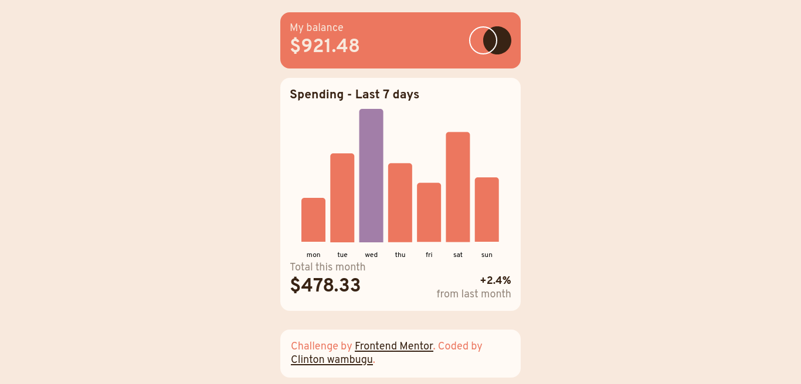

# Frontend Mentor -  ExpenseChart component solution(Angular 14)

This is a solution to the [Expenses chart component challenge on Frontend Mentor](https://www.frontendmentor.io/challenges/expenses-chart-component-e7yJBUdjwt). Frontend Mentor challenges help you improve your coding skills by building realistic projects.

## Table of contents

- [Overview](#overview)
  - [The challenge](#the-challenge)
  - [Screenshot](#screenshot)
  - [Links](#links)
- [My process](#my-process)
  - [Built with](#built-with)
  - [Installation](#installation)
  - [What I learned](#what-i-learned)
  - [Continued development](#continued-development)
  - [Useful resources](#useful-resources)
- [Author](#author)
- [Acknowledgments](#acknowledgments)


## Overview

### The challenge

Users should be able to:

- View the bar chart and hover over the individual bars to see the correct amounts for each day
- See the current day’s bar highlighted in a different colour to the other bars
- View the optimal layout for the content depending on their device’s screen size
- See hover states for all interactive elements on the page
- **Bonus**: Use the JSON data file provided to dynamically size the bars on the chart

### Screenshot



### Links

- Solution URL: [Add solution URL here](https://your-solution-url.com)
- Live Site URL: [Add live site URL here](https://your-live-site-url.com)


## My process

### Built with

- Semantic HTML5 markup
- CSS custom properties
- Mobile-first workflow
- [Angular 14](https://angular.io/docs) - JS library
- [Ngx charts](https://swimlane.gitbook.io/ngx-charts/) - For the chart

## Installation

This project was generated with [Angular CLI](https://github.com/angular/angular-cli) version 14.1.1.

## Development server

Run `ng serve` for a dev server. Navigate to `http://localhost:4200/`. The application will automatically reload if you change any of the source files.

## Code scaffolding

Run `ng generate component component-name` to generate a new component. You can also use `ng generate directive|pipe|service|class|guard|interface|enum|module`.

## Build

Run `ng build` to build the project. The build artifacts will be stored in the `dist/` directory.

## Running unit tests

Run `ng test` to execute the unit tests via [Karma](https://karma-runner.github.io).

## Running end-to-end tests

Run `ng e2e` to execute the end-to-end tests via a platform of your choice. To use this command, you need to first add a package that implements end-to-end testing capabilities.

## Further help

To get more help on the Angular CLI use `ng help` or go check out the [Angular CLI Overview and Command Reference](https://angular.io/cli) page.


### What I learned

I learnt how to incorporate charts in my application using ngx chart which provides an easy way to create charts and customize them.
I installed ngx chart using the following command:

```
npm install @swimlane/ngx-charts --save
```
At the time of installation I got the following error:
```
ERROR in The target entry-point "@swimlane/ngx-charts" has missing dependencies:
```
solved this by running the following command:
```
npm install @angular/cdk --save
```
Add the following import in app.module.ts
```
Import {NgxChartsModule } from 'ngx-charts';
import { BrowserAnimationsModule } from '@angular/platform-browser/animations';

```
included this in the list of imports in app.module.ts
```
imports: [
    ...
    NgxChartsModule,
    BrowserAnimationsModule
  ]
```
Followed by adding it to the parent component balance.component.html:
```
    <ngx-charts-bar-vertical [results]="expenses" [xAxis]="true" [animations]="false" [showGridLines]="false" [roundEdges]="true" [customColors]="colors">
    </ngx-charts-bar-vertical>
```

### Useful resources

- [How to add Ngx chart to angular app](https://www.ngdevelop.tech/how-to-use-ngx-charts-in-angular/) - This helped me when I was stuck try to display the bar chart in the application.


## Author

- Website - [Clinton wambugu](https://clintonwambugu-portfolio.herokuapp.com/)
- Frontend Mentor - [Clinton-dev](https://www.frontendmentor.io/profile/Clinton-dev)
- Twitter - [@WambuguClinton](https://twitter.com/WambuguClinton)
